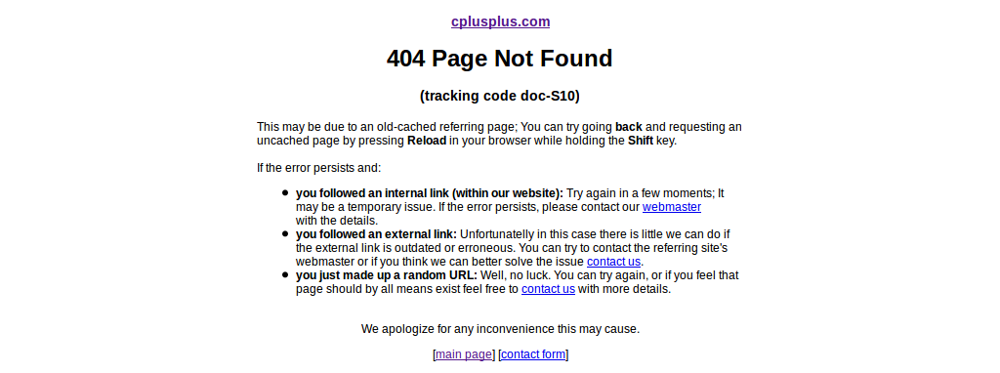
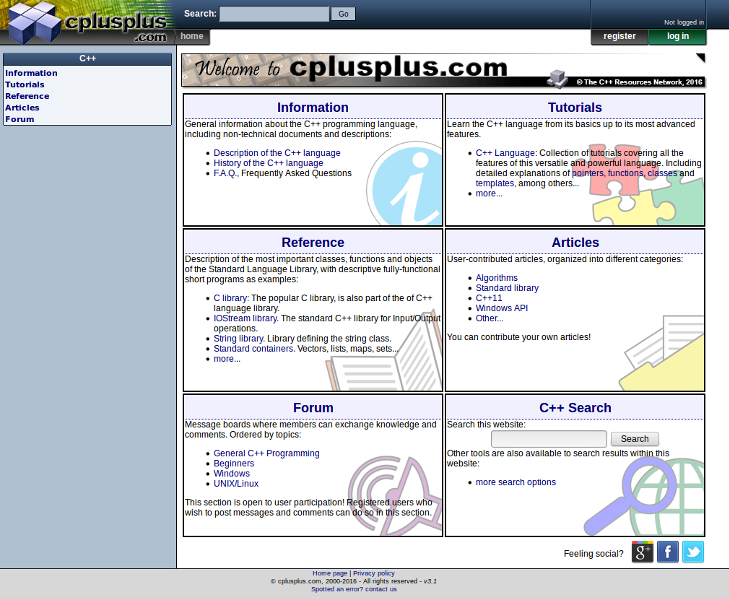

# Caratteristiche generali

Come accennato nell'introduzione, in questa sezione si andrà ad analizzare 
tutti quei componenti fondamentali per garantire la buona usabilità del sito.

È importante comprendere se elementi come il testo, le immagini, la
navigazione interna sono state implementate in modo accurato, essendo la 
base infrastrutturale dove appoggiare i vari servizi offerti da 
**cplusplus.com**. Una mancanza di cura in alcune di queste caratteristiche 
porterà una inevitabile deficienza globale causando una valutazione negativa del
sito.

## Testo
### Premesse
Il testo gioca un ruolo chiave in ogni sito web, specialmente sulla tipologia
a scopo informativo in cui l'utente necessita di un buon livello di leggibilità.
Un testo facilmente leggibile porta con se vantaggi in termini di **tempo** e 
**gradimento**:

* tempo perché consente di trovare l'informazione più velocemente;
* gradimento perché non richiede sforzo durante la lettura;

Altro punto da considerare è la distribuzione del testo all'interno pagine:
blocchi fini di testo produrranno, durante la fase di "scanning" svolta dall'
utente, una *mappa mentale* dell'informazione della pagina più accurata,
garantendo una maggior velocità di ritrovamento del contenuto interessante;
al contrario, blocchi compatti impedisco la creazione di associazioni e perciò 
la ricerca risulterà più lenta e faticosa.

### Aspettative
Data la natura semplicista del sito il testo dovrà avere un solo tipo di font,
evitando l'uso del testo come **decorazione**, che diminuirebbe la leggibilità. 

Inoltre, vista la presenza di una sezione articoli e forum **pubblica**, è 
necessario scegliere con cura la grandezza del testo e il tipo di font per 
evitare la creazione di pagine molto faticose da leggere, sopratutto in caso di 
un'**alta densità** di parole in blocchi compatti.

### Analisi
Il font scelto è il **Verdana**, altamente leggibile, di dimensioni di 12pt, 
vicini al limite minimo dei 10pt. La resa complessiva è **discreta**, infatti
con un ingrandimento del testo, ad esempio di uno due punti, il sito avrebbe 
reso di più e sarebbe migliorata la lettura dei blocchi di testo.

**Non** è presente alcuna forma di selezione del font. L'assenza di modifica del
tipo è accettabile, data la tipologia d'utenza, ma un'opzione per l'
ingrandimento del testo sarebbe dovuta essere presente, sopratutto alla luce di
quanto detto sopra. 

Nel sito web i testi vengono sempre trascritti con colore nero su sfondo bianco,
ottenendo il massimo del contrasto.

Elementi ben fatti sono gli *snippet* del codice, come quello in figura sotto.

Molto utili a chiunque si imbarchi in questo genere di letture, queste aree,
dove vengono renderizzati spezzoni di comandi in C/C++ sono **ottimi**: 
non presentano problemi di dimensione del testo, utilizzano il font Verdana, 
hanno un buon contrasto con lo sfondo, ed infine, l'evidenziazione automatica 
del tipo di codice (variabile, commento, letterale, ...) ed il numero di riga 
in fianco a sinistra garantiscono altissima usabilità.

### Conclusione
Dall'analisi è emerso un problema per quanto riguarda la dimensione del font 
che causerà una **probabile diminuzione** d'efficacia della *mappa mentale*, 
prodotta dall'utente nella fase di "scanning" del sito, ed uno sforzo superiore
durante la lettura. Con l'inserimento di un menù per la modifica del carattere
si sarebbe potuto evitare questo problema.

Per il resto **soddisfa** le aspettative, scegliendo un font unico ad alta 
leggibilità e mantenendo un ottimo contrasto su tutte le pagine.

## Immagini
### Premesse
Le immagini sono da considerare in secondo piano rispetto al testo però non sono
da escludere: esse hanno un effetto attrattivo, nel caso di taglie maggiori 
di 210x230 px, che invoglia l'utente a cliccarci sopra; perciò è sempre il 
caso di inserire un evento correlato in caso di click.

Un'altro aspetto è l'uso di immagini per dare informazioni. In quel caso 
bisogna stare attenti ad non incombere in *metafore visive tradite*, ovvero
quando l'utente è ingannato dall'aspetto grafico o rappresentano concetti
non **immediatamente** intuibili.

### Aspettative
In quanto le immagini sono per la maggior parte presenti nella sezione 
*Articles*, che ricordo essere pubblica, il contenuto non è sotto il controllo 
degli sviluppatori. Tuttavia nulla vieta di inserire un comportamento di 
default nel caso d'immagini superiori alla taglia 210x230 px, come ad esempio
la visualizzazione a pieno schermo. 

Le icone usate in varie parti del sito sono molto semplici e ben fatte, però
bisogna verificare la loro effettiva chiarezza di significato.

Tuttavia il giudizio sulla gestione delle immagini non peserà sulla 
valutazione finale dato il loro ruolo marginale.

### Valutazione
Per quanto riguarda le immagini presenti nei testi, soprattutto nella sezione 
*Articles*, non è risultato alcun evento correlato alla pressione del mouse.

Sono da segnalare due icone che causano l'effetto della *metafora visiva 
tradita*: un'icona indica che un'eventuale funzionalità è stata introdotta
con *C++11*, e i vecchi compilatori potrebbero non supportarla; l'altra viene 
usata nei menù sul lato destro per ordinare le voci presenti in ordine 
alfabetico se cliccata.

Nel primo caso l'icona appare come un triangolo giallo di attenzione con 
a fianco un'etichetta con scritto "C++11". Non è chiaro il **concetto** che 
vuole esprimere, anzi, può portare a conclusioni errate.

La seconda icona non è immediato capire cosa rappresenti e costringe l'utente
a cliccarci sopra, sempre se la cliccherà, per capire cosa fa.

Il resto delle icone appaiono chiare e ben contestualizzate, arricchendo la
grafica del sito senza incombere in *bloated design*.

### Conclusione
In conclusione direi che l'uso delle icone è **apprezzabile**. Danno un aspetto
visivo al sito più gradevole e risultano intuitive all'utente.

Peccato per un'attenzione posta alle immagini inserite nei testi 
**superficiale**. Di fatto l'usabilità ne risente ma in minima parte dato il 
ruolo che hanno.

## Navigabilità

### Premesse
In questa sezione analizzerò quelli che sono i *sei assi informativi* di una 
pagina web, ovvero:
* **Where**: indica a che tipo di sito siamo arrivati
* **Who**: indica chi rappresenta il sito
* **Why**: indica i benefici del sito, il motivo per il quale dovremmo 
utilizzarlo
* **What**: indice le offerte del sito
* **When**: indica le ultime novità presenti nel sito
* **How**: indica come arrivare alle sezioni principali del sito

Mi concentrerò principalmente sulla homepage di **cplusplus.com**. Ricordiamo 
che una pagina principale di qualità deve soddisfare tutti questi assi in modo 
da poter soddisfare l'utente.

### Aspettative
Data la moltitudine di offerte che il sito offre è bene aspettarsi un asse
**when** fornito: ultimi articoli inseriti, discussioni più seguite sui forum,
aggiornamenti sulla documentazione e cosi via. Gli assi **why**, **where** e 
**what** vanno ben definiti in modo da non lasciare l'utente smarrito e senza 
alcuna motivazione ad esplorare il sito. L'asse **how** aiuta l'utente ad 
orientarsi, soprattutto se è la prima visita, e l'asse **who** è bene indicarlo
per una fattore di *trust*.

Sarà interessante vedere com'è implementata la barra di ricerca che può dare un 
sicuro valore aggiunto a questa tipologia di sito.

Non mi aspetto problemi dal *back button* lasciando libero l'utente di tornare
indentro da ogni pagina. 

Infine, dovrebbe essere presente una pagina *404* da avvisare l'utente in caso
di *broken link*.

### Valutazione
Inizio dall'asse sicuramente meglio riuscito: il *what*. Come è possibile vedere
dall'immagine dell'homepage del sito di **cplusplus.com**, nel riquadro centrale
è possibile vedere la lista delle sezioni offerte con una relativa descrizione.

Funzionale all'asse *what* è il layout: ottima la scelta di usare il tipo a griglia in
modo da visualizzare l'intera pagina senza necessità di scroll. Questa scelta
impone all'utente maggior sforzo, rispetto ad un layout a lista, ma 
l'eliminazione dello scroll verticale è sicuramente da preferire.

Per quanto riguarda l'asse *where*, con la pagina centrale, non dovrebbero esserci
dubbi sulle finalità del sito.

**Positiva** la presenza del *breadcrumb* di tipo *location* che aiuta l'utente
a non essere afflitto dal problema *lost in navigation*.

Una consuetudine non standard ma riconosciuta in tutto il web è cambiare il 
colore dei link visitati. Con questo stratagemma l'utente non è costretto a
ricordarsi quali pagine ha già visitato, la quale creerebbe **malumore** dato 
lo sforzo eccessivo. 

Tuttavia, **cplusplus.com** fa parte del 25% dei siti web che **non adotta** 
questa tecnica, lasciano il colore dei link invariato anche dopo averlo 
visitato.

Per quanti riguarda i *broken link*, il sito propone una propria pagina *404* 
(figura sotto) per avvisare l'utente del mancato reperimento della risorsa 
cercata. 

Appropriata la presenza di spiegazioni su cosa fare in base a come si è 
raggiunto lo stato 404, dando un notevole supporto all'utente. Peccato per l'uso
di uno stile serio che non permette il rilassamento dei timer degli utenti,
come accade in presenza di testi ed immagini ironici e divertenti.

L'asse *why* è legato alle descrizione in ogni servizio, ma non vi sono mai 
riferimenti espliciti ad effettivi vantaggi.

Non è chiaro se il sito rappresenti un ente privato o un'organizzazione, quindi
l'asse *who* non si può dire soddisfatto.

Oltre ai link interni alle sezioni in ogni riquadro della scheda centrale, è 
possibile usare il menù nel lato sinistro con i link a tutte le sezioni. In
questo modo l'asse *how* è pienamente soddisfatto.

L'ultimo asse, *when*, è stato **completamente trascurato**: non vi è presenza 
né nella homepage né nelle pagine interne di alcun sistema per ottenere le 
novità del sito. Data la presenza di un **forum** ed una sezione **articoli**,
oltre che del **reference**, non è trascurabile una mancanza di questo genere
il che ne consegue una grossa perdita d'usabilità.

Provando il bottone indietro del browser in varie pagine **non sono apparsi** 
casi di comportamenti anomali assicurando un gradimento maggiore all'utente.

Concludo con un'analisi sulla barra di ricerca. Come si può vedere in figura
la presenza di **due** barre di ricerca nell'homepage non può altro che 
generare confusione. Infatti provandole entrambe il risultato è identico:
* se la keyword cercata fa parte delle voci nel *Reference* si viene subito
  reindirizzati li nel reference;
* se la keyword non è una voce del *Reference* appare la lista dei risultati
  trovati;

questo comportamento è utile ma **non segue gli standard** dei motori di 
ricerca classici, generando una frustrazione iniziale agli utenti.
Come soluzione, nella pagina in cui si è arrivati, viene inserito un link per 
tornare alla lista dei risultati del motore di ricerca. Tuttavia, cosi facendo 
l'utente spreca tempo e click per un'agevolazione non richiesta.

Quando compare la lista dei risultati scopriamo che il servizio di ricerca usa
il modulo offerto da Google per i siti web. 

Il sistema funziona egregiamente per via della popolarità del sito, ma
può incombere nei problemi dell'uso di queste soluzioni a basso costo, come la
non copertura totale delle pagine, soprattutto nelle sezioni al di fuori di
*Reference* che sono meno cercate. Le opzioni di ricerca si limitano a 
specificare dove effettuare la ricerca: o in tutto il sito, o solo in *Reference*,
o solo in *Forum* o solo in *Articles*.

Il risultato appare in forma di lista, come la pagina di Google, e
quindi è familiare all'utente. Nel caso non vi fossero risultati la notifica 
avviene attraverso una striscia con la scritta *No Results*.

### Conclusione
Sicuramente **cplusplus.com** è pensato per dare il massimo supporto alla 
navigazione nella sezione *Reference*, a discapito degli altri servizi. Scelta
comprensibile dato che il sito è principalmente usato per la consultazione 
della documentazione. 

Tuttavia il sito è globalmente penalizzato per via della mancanza 
d'informazioni relative all'asse *when* e la scelta di non colorare i link già
visitati.

Buona la ricerca attraverso il tool di Google ma sarebbe da eliminare il redirect
diretto alla pagina del *Reference* che non aggiunge molto.

## Pubblicità
### Premesse
La pubblicità è un'arma a doppio taglio: può essere fonte di guadagno per il 
sito ma se non ben gestita può causare un crollo sull'usabilità.

### Aspettative
Essendo presente nel sito è bene controllare che non sia invadente e che lasci
spazio alla lettura.

### Valutazione
La pubblicità è posizionata nelle pagine interne della sezione *Reference* in
due punti: in alto nella colonna centrale ed in basso nella colonna laterale a 
sinistra; e nella lista dei risultati attraverso la barra di ricerca.

Nota positiva per le prime due che non sono invasive durante la lettura e 
propongono di default pubblicità inerenti al tema trattato nel sito. Inoltre la
seconda inserzione usa lo stesso stile degli altri riquadri presenti nella 
colonna di sinistra, creando un effetto *blending* davvero eccellente.
 
Peccato che dopo la navigazione in altri siti questi effetti **spariscono**
ritornando ad inserzioni pubblicitarie che causano il *distraction effect*. 

In fine la scelta del posizionamento non è delle migliori. La colonna centrale
può andare ma l'inserzione nella colonna di navigazione a sinistra, visualizzata
come ultimo riquadro, praticamente non verrà mai selezionata dall'utente. Sarebbe
stato meglio metterla in cima, garantendosi la migliore posizione nella pagina 
web.

L'ultima inserzione, quella nella lista dei risultati di ricerca, è invece
molto evidente e per l'effetto *zapping* risulta poco efficacie.

### Conclusione
L'unico vero difetto incotrato è il posizionamento, che non permette di agli 
inserti pubblicitari di risultare efficaci. Per il resto il livello di qualità 
è **buono**.
