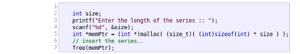

# Caratteristiche generali

Come accennato nell'introduzione, in questo capitolo si andrà ad analizzare 
tutti quei componenti fondamentali per garantire la buona usabilità del sito.

E' importante comprendere se elementi come: il testo, le immagini, la
navigazione interna; siano state implementate in modo accuranto, essendo la 
base infrastrutturale dove appoggiare i vari servizi offerti da 
**cplusplus.com**. Una mancanza di cura in alcune di queste caratteristiche 
porterà una inevitabile deficienza globale causando una valutazione negativa del
sito.

## Testo
### Premesse
Il testo gioca un ruolo chiave in ogni sito web, specialemente sulla tipologia
a scopo informativo in cui l'utente necessita di un buon livello di leggibilità.
Un testo facilmente leggibile porta con se vantaggi in termini di **tempo** e 
**gradiemento**:

* tempo perchè consente di trovare l'informazione più velocemente;
* gradimento perchè non richiede sforzo durante la lettura;

Altro punto da considerare è come viene distribuito il testo all'interno delle
pagine.

Blocchi fini di testo produrranno, durante la fase di "scanning" svolta dall'
utenta, una *mappa mentale*, dell'informazione della pagina, più accurata
garantendo una maggior velocità di ritrovamento del contenuto interessate.

Blocchi compatti impedisco la creazione di assiociazioni e perciò la ricerca 
risulterà più lenta e faticosa.

### Parametri di valutazione
In primo luogo si valuterà se il formato e l'uso del testo scelto per l'intero
sito è studiato per assicurare una facile lettura. Successivamente saranno
valutate le sezione *Reference* ed *Articles* osservando se il testo ha una
disposizione intelligente da sfruttare la fase di "scanning" per diminuire i
tempi di ricerca; soprattuto nel reference dove questo bisogno è maggiormente 
sentito.

### Analisi

Il font scelto è il **verdana**, altamente leggibile, di dimensioni di 12pt, 
vicini al limite minimo dei 10pt. La resa complessiva è **discreta**; con un
ingrandimento del testo, di uno due punti, avrebbe reso di più e migliorato la
lettura dei blocchi di testo.

**Non** è presente alcuna forma di selezione del font. L'assenza di modifica del
tipo è accettabile, data la tipologia d'utenza; però un'opzione per l'
ingrandimento del testo sarebbe dovuta essere presente, soprattuto in vista dei
commenti fatti sopra. 

Nel sito web i testi vengono sempre trascritti con colore nero su sfondo bianco,
ottenendo il massimo del contrasto.

Elementi molto ben fatti sono gli *snippet* del codice, come quello in figura
sotto.

Molto utili a chiunque si imbarchi in questo genere di letture; queste aree
dove vengono renderizzati spezzoni di comandi in C/C++ sono **ottimi**: 
non presentano problemi di dimensione del testo, usano sempre il font verdana, 
hanno un buon contrasto con lo sfondo, ed infine, l'evidenziazione automatica 
del tipo di codice (variabile, commento, letterale, ...) ed il numero di riga 
in fianco a sinistra garantiscono altissima usabilità.

